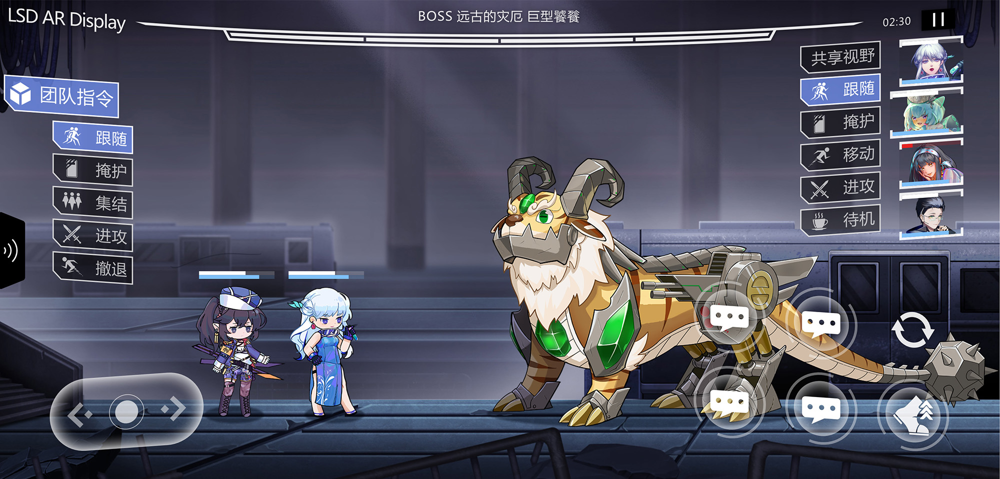

# 《灵数奇缘》游戏项目

## 开发测试使用说明

* Spine 目录下的资源请按需从 [LSD-spine-1x](https://github.com/IppClub/LSD-spine-1x.git) 或是 [LSD-spine-2x](https://github.com/IppClub/LSD-spine-2x) 仓库获取普通或是高清分辨率的美术素材，复制到该目录下使用。

* 克隆或是下载项目，然后将该项目通过 Web IDE 上传至[Dora-SSR](https://github.com/IppClub/Dora-SSR)中。然后进行运行和测试。

## 美术、音乐素材版权

归《灵数奇缘》社区所有，相关资产授权见[这里](https://luv-sense-digital.readthedocs.io/community/licencing.html)。

## 程序代码授权

MIT
