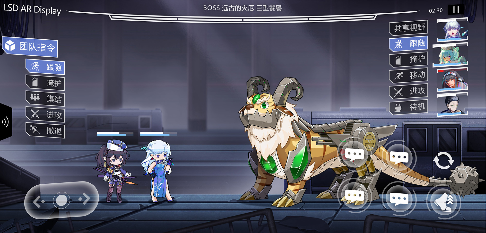

# 《灵数奇缘》游戏项目

[![IppClub](https://img.shields.io/badge/I%2B%2B%E4%BF%B1%E4%B9%90%E9%83%A8-%E8%AE%A4%E8%AF%81-11A7E2?logo=data%3Aimage%2Fsvg%2Bxml%3Bcharset%3Dutf-8%3Bbase64%2CPHN2ZyB2aWV3Qm94PSIwIDAgMjg4IDI3NCIgeG1sbnM9Imh0dHA6Ly93d3cudzMub3JnLzIwMDAvc3ZnIiB4bWw6c3BhY2U9InByZXNlcnZlIiBzdHlsZT0iZmlsbC1ydWxlOmV2ZW5vZGQ7Y2xpcC1ydWxlOmV2ZW5vZGQ7c3Ryb2tlLWxpbmVqb2luOnJvdW5kO3N0cm9rZS1taXRlcmxpbWl0OjIiPjxwYXRoIGQ9Im0xNDYgMzEgNzIgNTVWMzFoLTcyWiIgc3R5bGU9ImZpbGw6I2Y2YTgwNjtmaWxsLXJ1bGU6bm9uemVybyIvPjxwYXRoIGQ9Im0xNjkgODYtMjMtNTUgNzIgNTVoLTQ5WiIgc3R5bGU9ImZpbGw6I2VmN2EwMDtmaWxsLXJ1bGU6bm9uemVybyIvPjxwYXRoIGQ9Ik0yNiAzMXY1NWg4MEw4MSAzMUgyNloiIHN0eWxlPSJmaWxsOiMwN2ExN2M7ZmlsbC1ydWxlOm5vbnplcm8iLz48cGF0aCBkPSJNMTA4IDkydjExMmwzMS00OC0zMS02NFoiIHN0eWxlPSJmaWxsOiNkZTAwNWQ7ZmlsbC1ydWxlOm5vbnplcm8iLz48cGF0aCBkPSJNMCAyNzR2LTUyaDk3bC0zMyA1MkgwWiIgc3R5bGU9ImZpbGw6I2Y2YTgwNjtmaWxsLXJ1bGU6bm9uemVybyIvPjxwYXRoIGQ9Im03NyAyNzQgNjctMTA3djEwN0g3N1oiIHN0eWxlPSJmaWxsOiNkZjI0MzM7ZmlsbC1ydWxlOm5vbnplcm8iLz48cGF0aCBkPSJNMTUyIDI3NGgyOWwtMjktNTN2NTNaIiBzdHlsZT0iZmlsbDojMzM0ODVkO2ZpbGwtcnVsZTpub256ZXJvIi8%2BPHBhdGggZD0iTTE5MSAyNzRoNzl2LTUySDE2N2wyNCA1MloiIHN0eWxlPSJmaWxsOiM0ZTI3NWE7ZmlsbC1ydWxlOm5vbnplcm8iLz48cGF0aCBkPSJNMjg4IDEwMGgtMTdWODVoLTEzdjE1aC0xN3YxM2gxN3YxNmgxM3YtMTZoMTd2LTEzWiIgc3R5bGU9ImZpbGw6I2M1MTgxZjtmaWxsLXJ1bGU6bm9uemVybyIvPjxwYXRoIGQ9Im0yNiA4NiA1Ni01NUgyNnY1NVoiIHN0eWxlPSJmaWxsOiMzMzQ4NWQ7ZmlsbC1ydWxlOm5vbnplcm8iLz48cGF0aCBkPSJNOTMgMzFoNDJsLTMwIDI5LTEyLTI5WiIgc3R5bGU9ImZpbGw6IzExYTdlMjtmaWxsLXJ1bGU6bm9uemVybyIvPjxwYXRoIGQ9Ik0xNTggMTc2Vjg2bC0zNCAxNCAzNCA3NloiIHN0eWxlPSJmaWxsOiMwMDU5OGU7ZmlsbC1ydWxlOm5vbnplcm8iLz48cGF0aCBkPSJtMTA2IDU5IDQxLTEtMTItMjgtMjkgMjlaIiBzdHlsZT0iZmlsbDojMDU3Y2I3O2ZpbGwtcnVsZTpub256ZXJvIi8%2BPHBhdGggZD0ibTEyNCAxMDAgMjItNDEgMTIgMjctMzQgMTRaIiBzdHlsZT0iZmlsbDojNGUyNzVhO2ZpbGwtcnVsZTpub256ZXJvIi8%2BPHBhdGggZD0ibTEwNiA2MCA0MS0xLTIzIDQxLTE4LTQwWiIgc3R5bGU9ImZpbGw6IzdiMTI4NTtmaWxsLXJ1bGU6bm9uemVybyIvPjxwYXRoIGQ9Im0xMDggMjA0IDMxLTQ4aC0zMXY0OFoiIHN0eWxlPSJmaWxsOiNiYTAwNzc7ZmlsbC1ydWxlOm5vbnplcm8iLz48cGF0aCBkPSJtNjUgMjc0IDMzLTUySDBsNjUgNTJaIiBzdHlsZT0iZmlsbDojZWY3YTAwO2ZpbGwtcnVsZTpub256ZXJvIi8%2BPHBhdGggZD0iTTc3IDI3NGg2N2wtNDAtNDUtMjcgNDVaIiBzdHlsZT0iZmlsbDojYTgxZTI0O2ZpbGwtcnVsZTpub256ZXJvIi8%2BPHBhdGggZD0iTTE2NyAyMjJoNThsLTM0IDUyLTI0LTUyWiIgc3R5bGU9ImZpbGw6IzExYTdlMjtmaWxsLXJ1bGU6bm9uemVybyIvPjxwYXRoIGQ9Im0yNzAgMjc0LTQ0LTUyLTM1IDUyaDc5WiIgc3R5bGU9ImZpbGw6IzA1N2NiNztmaWxsLXJ1bGU6bm9uemVybyIvPjxwYXRoIGQ9Ik0yNzUgNTVoLTU3VjBoMjV2MzFoMzJ2MjRaIiBzdHlsZT0iZmlsbDojZGUwMDVkO2ZpbGwtcnVsZTpub256ZXJvIi8%2BPHBhdGggZD0iTTE4NSAzMWg1N3Y1NWgtMjVWNTVoLTMyVjMxWiIgc3R5bGU9ImZpbGw6I2M1MTgxZjtmaWxsLXJ1bGU6bm9uemVybyIvPjwvc3ZnPg%3D%3D&labelColor=fff)](https://ippclub.org)

<p align="center">
	
</p>

------

## 项目简介

《灵数奇缘》是一款基于 [Dora SSR](https://github.com/IppClub/Dora-SSR) 引擎开发的 2D 游戏项目。项目采用 Yue Script 脚本语言编写，使用 Spine 动画技术，包含完整的游戏系统、UI 界面和音乐资源。

## 项目结构

```
├── init.yue              # 入口文件，负责环境初始化和资源路径设置
├── Start.yue             # 主启动文件，初始化数据库和游戏流程
├── Script/               # 游戏脚本目录
│   ├── System/          # 系统脚本（开场动画、对话等）
│   ├── Scene/           # 场景脚本（休息室、训练场等）
│   ├── Academy/         # 学院关卡脚本
│   └── Control.yue      # 控制脚本
├── UI/                   # 用户界面文件
│   ├── *.yue            # Yue 脚本格式的 UI 组件
│   ├── *.xml            # XML 格式的 UI 布局文件
│   └── View/            # 视图组件
├── Data/                 # 游戏数据目录
│   ├── Config.tl        # 游戏配置文件
│   └── *.json           # JSON 格式的数据文件
├── Spine/                # Spine 动画资源目录
├── Image/                # 图像资源目录
├── Music/                # 音乐资源目录
├── Font/                 # 字体文件目录
└── Test/                 # 测试用例目录
```

## 开发环境配置

### 必备工具

1. **Dora SSR 引擎**：从 [Dora-SSR](https://github.com/IppClub/Dora-SSR) 获取
2. **Spine 动画资源**：根据需要从以下仓库获取：
   - 普通分辨率：[LSD-spine-1x](https://github.com/IppClub/LSD-spine-1x)
   - 高清分辨率：[LSD-spine-2x](https://github.com/IppClub/LSD-spine-2x)

### 运行步骤

1. 克隆或下载本项目
2. 将 Spine 动画资源复制到 `Spine/` 目录
3. 通过 Web IDE 将项目上传至 Dora-SSR
4. 在 Dora-SSR 中运行和测试

## 配置说明

游戏的主要配置位于 `Data/Config.tl` 文件中，常用配置项包括：

- **skipOP**：控制是否跳过开场动画
  - `0` - 播放开场动画（默认）
  - `1` - 跳过开场动画

## 主要功能

- 完整的游戏流程（开场动画 → 教程关卡 → 游戏主界面）
- 丰富的 UI 系统（对话框、状态栏、技能面板等）
- Spine 动画支持
- 场景系统（休息室、训练场、学院关卡等）
- 战斗和技能系统
- 角色成长系统



## 开发测试使用说明

* Spine 目录下的资源请按需从 [LSD-spine-1x](https://github.com/IppClub/LSD-spine-1x.git) 或是 [LSD-spine-2x](https://github.com/IppClub/LSD-spine-2x) 仓库获取普通或是高清分辨率的美术素材，复制到该目录下使用。

* 克隆或是下载项目，然后将该项目通过 Web IDE 上传至 [Dora-SSR](https://github.com/IppClub/Dora-SSR) 中。然后进行运行和测试。

## 美术、音乐素材版权

归《灵数奇缘》社区所有，相关资产授权见[这里](https://luv-sense-digital.readthedocs.io/community/licencing.html)。


## 程序代码授权

MIT

## 致谢

- 感谢 [IppClub](https://ippclub.org) 提供的技术支持
- 感谢《灵数奇缘》社区提供的美术和音乐资源
